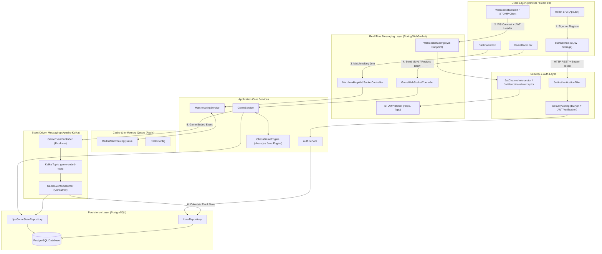
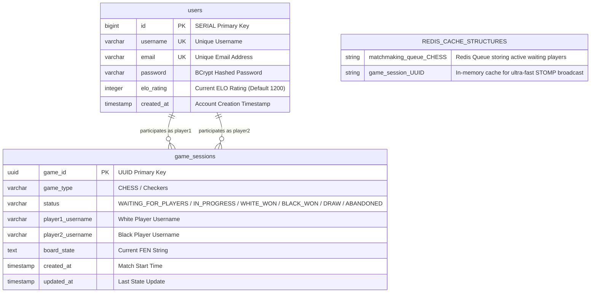
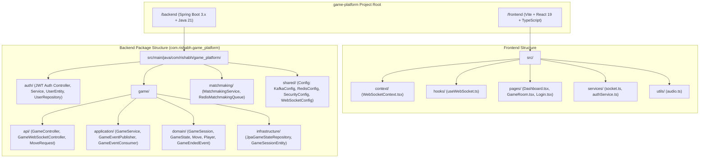
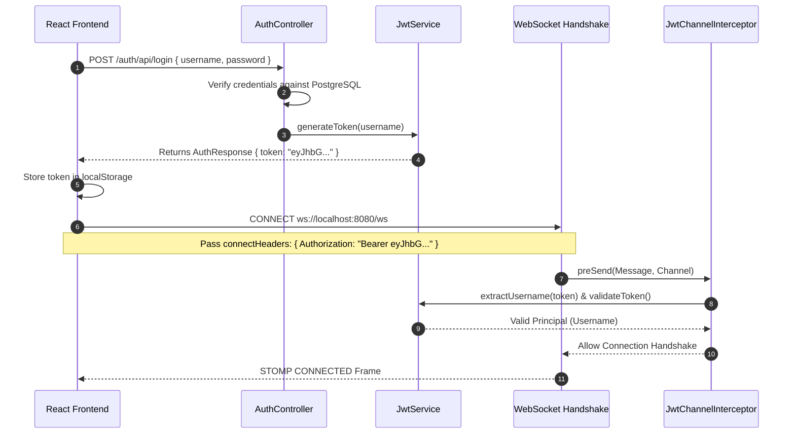
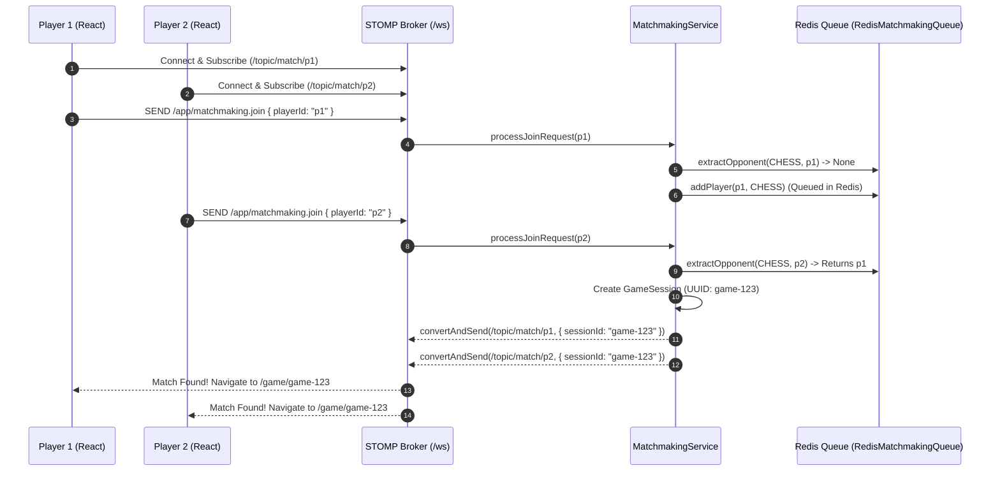
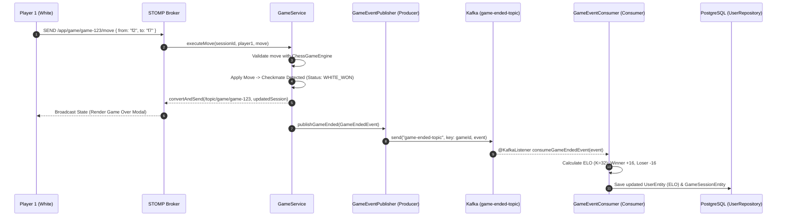

# Distributed Real-Time Multiplayer Chess Platform

A production-grade, event-driven, full-stack multiplayer gaming platform built with Spring Boot 3, React 19, STOMP WebSockets, Redis, Apache Kafka, and PostgreSQL. Designed with domain-driven principles, decoupled architecture, and real-time state synchronization.

---

<!-- Badges showcasing CI, coverage, and Docker -->

[](https://github.com/2005rishabh/game-platform/actions)
[](https://codecov.io/gh/2005rishabh/game-platform)
[](https://hub.docker.com/r/2005rishabh/game-platform)
[](https://game-platform-orpin-zeta.vercel.app)
[](https://game-platform-n1k1.onrender.com)
[](https://vercel.com)
[](https://dashboard.render.com)

## Live Demos

- **Frontend (Client):** https://game-platform-orpin-zeta.vercel.app/
- **Backend (API / WebSockets):** https://game-platform-n1k1.onrender.com/

## Table of Contents

- [Project Executive Summary](#1-project-executive-summary)
- [Technology Stack & Component Purpose](#2-technology-stack--component-purpose)
- [System Architecture & Flowcharts](#3-system-architecture--flowcharts)
  - [High-Level Architecture](#31-high-level-architecture-how-everything-is-linked)
  - [Database & Cache Schema Design](#32-database--cache-schema-design-postgresql--redis)
  - [Directory Structure Topology](#33-directory-structure-topology)
  - [Execution Sequence Flows](#34-execution-sequence-flows)
- [Key Platform Features](#4-key-platform-features)
- [Local Setup & Installation](#5-local-setup--installation)
- [WebSocket STOMP API Documentation](#6-websocket-stomp-api-documentation)

## Deployment

This project is deployed on Render (backend) and Vercel (frontend). Below are concise steps and tips to deploy and configure both services.

- Backend (Render)
  1. Build a container or use the provided `backend/Dockerfile`.
  2. In the Render dashboard, create a new Web Service and connect your GitHub repo.
  3. Set the build command (if using Docker, Render will build the image). For Maven-based deploys without Docker use:

     ```bash
     ./mvnw clean package -DskipTests
     java -jar backend/target/*.jar
     ```

  4. Environment variables to set on Render:
     - `SPRING_PROFILES_ACTIVE=prod` (optional)
     - Database/Redis/Kafka connection strings (e.g. `SPRING_DATASOURCE_URL`, `SPRING_REDIS_URL`)
     - `JWT_SECRET` and any other secrets
  5. (Optional) Keep service warm: use the `/health` endpoint added to the app and an external monitor (UptimeRobot or GitHub Actions) to hit `/health` regularly.

- Frontend (Vercel)
  1. In Vercel, import the repo and set the project root to `frontend`.
  2. Set the environment variable `VITE_API_URL` to your backend base URL, for example:

     `https://game-platform-n1k1.onrender.com`

     Important: Vite injects env vars at build-time. Do NOT include brackets or markdown formatting.

  3. Build & Output settings (Vercel):
     - Framework Preset: `Vite` or `Other` with `npm run build`
     - Build Command: `npm run build`
     - Output Directory: `dist`

  4. Deploy. For preview deployments, consider adding `*.vercel.app` or preview domains to Render CORS if you test previews.

## 1. Project Executive Summary

This platform delivers an enterprise-grade multiplayer experience featuring real-time state synchronization, automated matchmaking, event-driven ELO rating adjustments, and database persistence.

### Key Architectural Highlights

- **Persistent STOMP WebSockets**: Global WebSocket context management enabling zero-latency game state synchronization and uninterrupted reconnection across route transitions.
- **Distributed Redis Matchmaking**: High-throughput queue management for instant player pairing with zero self-matching edge cases.
- **Event-Driven ELO Rating Engine**: Asynchronous Kafka event bus processing match outcomes and executing standard Elo rating adjustments (K=32 factor).
- **Multi-Layer Persistence**: PostgreSQL relational persistence combined with in-memory Redis caching for game state queries.
- **JWT Security**: State-less authentication integrated across REST endpoints and WebSocket handshake/channel interceptors.

---

## 2. Technology Stack & Component Purpose

| Layer / Technology          | Technology Used                         | Purpose & Function                                                                    |
| :-------------------------- | :-------------------------------------- | :------------------------------------------------------------------------------------ |
| **Frontend Framework**      | React 19, TypeScript, Vite              | Component-driven UI rendering, type safety, fast client bundling.                     |
| **Chess Engine & UI**       | chess.js, react-chessboard              | Headless rule validation, move evaluation, interactive board interface.               |
| **Audio Engine**            | Web Audio API (Native Synthesizer)      | Synthesized audio feedback for moves, captures, checks, and game over.                |
| **Real-Time Communication** | STOMP over SockJS / WebSockets          | Duplex frame-based communication for matchmaking and live game turns.                 |
| **Backend Framework**       | Spring Boot 3.4, Java 21                | Microservice backend framework with dependency injection and modular packages.        |
| **Security & Auth**         | Spring Security, JJWT (JWT)             | Stateless token authentication, BCrypt password hashing, channel interceptors.        |
| **In-Memory Cache & Queue** | Redis, Spring Data Redis                | High-speed matchmaking queue storage and fast session caching.                        |
| **Event Streaming**         | Apache Kafka, Spring Kafka              | Distributed message broker for asynchronous post-match processing and rating updates. |
| **Relational Database**     | PostgreSQL, Spring Data JPA / Hibernate | Persistent storage for user accounts, historical match logs, and ELO ratings.         |
| **Containerization**        | Docker, Docker Compose                  | Containerized orchestration for Redis, Kafka, Zookeeper, and PostgreSQL.              |

---

## 3. System Architecture & Flowcharts

### 3.1 High-Level Architecture (How Everything Is Linked)



---

### 3.2 Database & Cache Schema Design (PostgreSQL + Redis)



---

### 3.3 Directory Structure Topology



---

### 3.4 Execution Sequence Flows

#### A. JWT Authentication Handshake Flow



#### B. Redis Matchmaking Queue Engine Working Flow



#### C. Apache Kafka Event-Driven ELO Pipeline Flow



---

## 4. Key Platform Features

### Real-Time Gameplay & State Engine

- **Authoritative Server Architecture**: Frontend sends move intents (`/app/game/{id}/move`); backend validates FEN positions and broadcasts authoritative game states.
- **Check & Checkmate Visual Indicators**: Highlights the checked King square in red (`rgba(239, 68, 68, 0.85)`) when `game.inCheck()` returns true.
- **Graveyard & Material Advantage Counter**: Calculates captured piece counts for White and Black, rendering captured SVG icons and material advantage scores (e.g., `+3`).
- **Native Synthesizer Sound Engine**: Built-in Web Audio API generator producing custom audio feedback for moves, captures, checks, and game-over events without external asset dependencies.
- **10-Minute Rapid Timers**: Synchronized active turn countdown clocks for both players.
- **Resignation & Draw Offers**: Dedicated UI actions publishing to `/app/game/{id}/resign` and `/app/game/{id}/draw`.
- **Game Over Modal**: Modal overlay displaying outcome, winner, end reason, and rating updates.

### Distributed Backend Infrastructure & Security

- **Redis Distributed Matchmaking**: Queue implementation pairing players atomically in O(1) time without self-matching edge cases.
- **Apache Kafka Asynchronous Event Streaming**: Match terminations publish `GameEndedEvent` to `game-ended-topic`.
- **Automated ELO Engine**: Asynchronous Kafka consumer implementing standard Elo rating calculations ($K = 32$):
  $$\text{Expected}_A = \frac{1}{1 + 10^{(R_B - R_A) / 400}}, \quad R'_A = R_A + K \times (S_A - \text{Expected}_A)$$
- **JWT Authentication Pipeline**: Secure authentication with custom Spring Security filters and STOMP channel interceptors validating Bearer tokens during WebSocket handshakes.
- **PostgreSQL Relational Storage**: JPA entities (`UserEntity`, `GameSessionEntity`) persisting accounts, rating histories, and finished match logs.

---

## 5. Local Setup & Installation

### Prerequisites

- Java 21 JDK
- Node.js 20+ & npm
- Docker & Docker Compose

### Step 1: Clone Repository

```bash
git clone https://github.com/2005rishabh/game-platform.git
cd game-platform
```

### Step 2: Start Infrastructure Services

Start PostgreSQL, Redis, Kafka, and Zookeeper via Docker Compose:

```bash
docker-compose up -d
```

### Step 3: Run Backend Service

```bash
cd backend
./mvnw spring-boot:run
```

The backend server runs on `http://localhost:8080`.

### Step 4: Run Frontend Application

```bash
cd ../frontend
npm install
npm run dev
```

The frontend dev server runs on `http://localhost:5173`.

---

## 6. WebSocket STOMP API Documentation

| Destination                    | Message Type | Payload Structure                                | Description                       |
| :----------------------------- | :----------- | :----------------------------------------------- | :-------------------------------- |
| `/app/matchmaking.join`        | SEND         | `{ "playerId": "string", "username": "string" }` | Enqueues player in Redis queue.   |
| `/app/matchmaking.cancel`      | SEND         | `{ "playerId": "string" }`                       | Removes player from queue.        |
| `/topic/match/{username}`      | SUBSCRIBE    | `{ "sessionId": "UUID" }`                        | Receive match notification.       |
| `/app/game/{sessionId}/move`   | SEND         | `{ "from": "e2", "to": "e4", "promotion": "q" }` | Submit move.                      |
| `/app/game/{sessionId}/resign` | SEND         | `{ "username": "string" }`                       | Resign current match.             |
| `/app/game/{sessionId}/draw`   | SEND         | `{ "username": "string" }`                       | Offer/accept draw.                |
| `/app/game/{sessionId}/state`  | SEND         | `{}`                                             | Request game state snapshot.      |
| `/topic/game/{sessionId}`      | SUBSCRIBE    | `GameSession Object`                             | Receive authoritative game state. |

---

Made with ❤️ by rishabh singh
